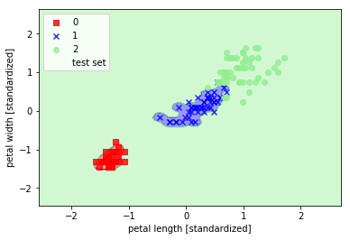
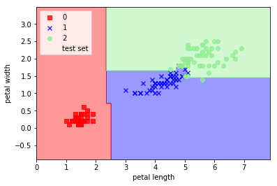
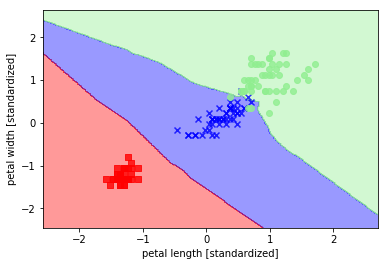

# Classification: Template Notebooks

Stuart Truax, 2019-9

These notebooks illustrate the basic components of creating and evaluating some common
classifiers using `python` and `scikit-learn`. The notebooks
cover:

 - __Decision Trees__
 - __k-Nearest Neighbors (k-NN)__
 - __Logistic Regression__
 - __Support Vector Machines (SVM)__

All notebooks are annotated with mathematical descriptions of the models and
methods being applied. All notebooks use input data from the `scikit-learn`
datasets. The codes and examples are derived with modification from [1].

# Contents

 - `DecisionTree.ipynb` - Decision tree classification of the `iris` dataset.
    Results of single decision tree and random forest classification demonstrated.

 - `kNN.ipynb` - k-nearest neighbors on the `iris` dataset.

 - `LogisticRegression.ipynb` - Logistic regression on the `iris` dataset.

 - `SVM.ipynb` - Linear SVM, soft margin classification, and kernel SVM applied to
    the `iris` dataset. Effect of gamma parameter tuning in Gaussian RBF kernel SVM
    demonstrated in tightening the decision boundary.

## Example Analysis Outputs

### Kernel SVM Decision Boundary

### Random Forest Classification

### k-NN Classification

### References

[1] S. Raschka, *Python Machine Learning*. Birmingham, UK: Packt Publishing, 2015.
